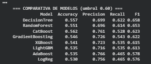

# analisis-riesgo-bancario-peru
Pipeline ETL en Python y Dashboard en Power BI para el análisis histórico de morosidad bancaria en Perú (2018-2025) basado en datos oficiales de la SBS
## Model Performance

The following table shows a comparison of different machine learning models
evaluated using Accuracy, Precision, Recall and F1-score (threshold = 0.60).

